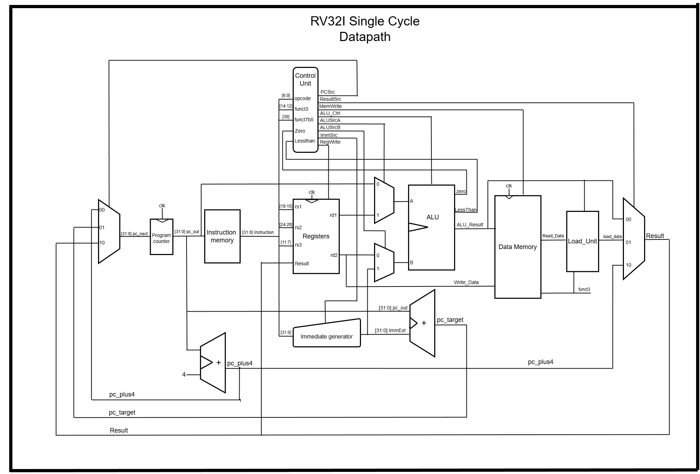
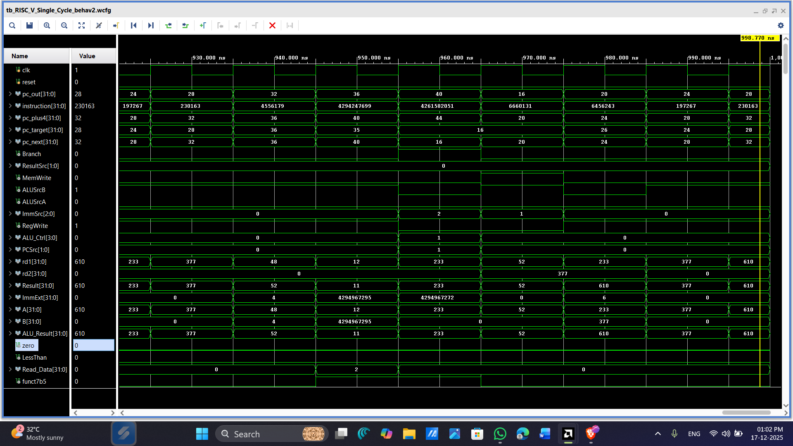
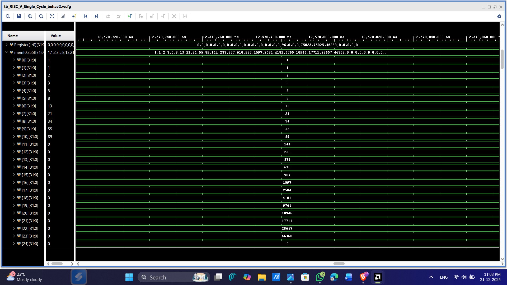

#  RV32I RISC-V Processor Core (Verilog)

# Project Overview

Welcome! This project is a personal journey into the heart of computer architecture. I’ve built a fully synthesizable **32-bit RISC-V (RV32I)** processor core from the ground up using Verilog HDL.

The design is heavily inspired by the architectural blueprints in **"Digital Design and Computer Architecture (RISC-V Edition)" by Sarah L. Harris and David Money Harris**. It isn't just a simulation—it's a synthesizable core ready for FPGAs or an ASIC flow like OpenLane.

---

# Key Features

* **Complete RV32I Base Set:** Supports all 39 instructions (Arithmetic, Logical, Branching, Memory, and Jumps).
* **Modular Design:** I’ve kept the Control Unit and Datapath strictly separated to make it easy to read and debug.
* **ASIC & FPGA Ready:** Tested for RTL synthesis; ready for Xilinx/Intel FPGAs or the Sky130 ASIC process.
* **Verified Hardware:** Functional correctness confirmed through instruction-level verification.

---

# The Instruction Set

The core handles the full 39-instruction suite of the RV32I specification:

* **Math:** `ADD`, `SUB`, `AND`, `OR`, `XOR`, `SLT` (+ Immediate versions)
* **Shifts:** `SLL`, `SRL`, `SRA` (+ Immediate)
* **Memory:** `LW` (Load Word) and `SW` (Store Word)
* **Flow Control:** `BEQ`, `BNE`, `BLT`, `BGE`, `JAL`, `JALR`
* **Upper Immediates:** `LUI`, `AUIPC`

> These are the supported instructions with address

()

---

### 🧱 Architecture

Currently, the repository features the **Single-Cycle implementation**.

> **Visualizing the Core:**
> Below is the block diagram I used to map out the connections between the Program Counter, Memory, Register File, and ALU.

()

### 🧪 Verification (How I know it works)

I believe hardware is only as good as its verification. I’ve used **Icarus Verilog** for simulation and **GTKWave** to verify every signal transition.

* **Instruction-level testing:** Every instruction has been put through a testbench to ensure the Register File and Memory update correctly.
* **Waveform Analysis:** Monitored the PC, ALU results, and Write-back stages to eliminate timing hazards.

> Below is the waveform results captured from vivado 

()

> Fibonacci series results

()

 

> Video of FPGA Testing of Fibonacci series 

Drive link : https://drive.google.com/drive/folders/1ptxFVm4Eos_x-h_8EqsXcriIdKmZnF0q?usp=sharing
 
---

###  What's Next? (The Roadmap)

This project is evolving! I am currently working on moving from a single-cycle design to more advanced architectures:

* **[In Progress] Multicycle Implementation:** Breaking instructions into multiple clock cycles to optimize for higher clock frequencies and unified memory (sharing Instruction and Data memory).
* **[Planned] 5-Stage Pipelining:** Implementing a classic `Fetch -> Decode -> Execute -> Memory -> Writeback` pipeline.
* **[Planned] Hazard Handling:** Adding Forwarding and Stalling logic to handle Data and Control hazards in the pipeline.
* **Physical Implementation:** Running the design through **OpenLane** to target the Sky130 process node.

> ACKNOWLEDGEMENT

A huge thank you to **Sarah and David Harris** for their incredible textbook. It served as the roadmap for this implementation.

